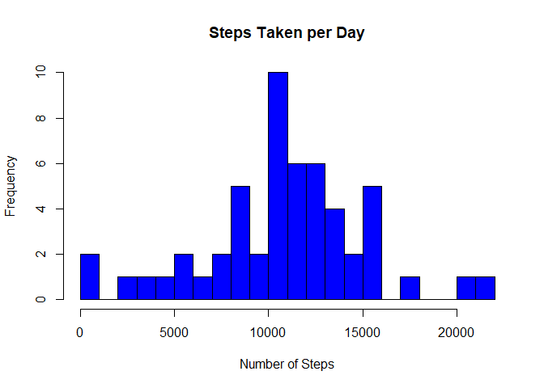
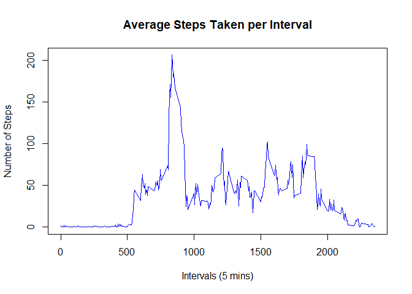
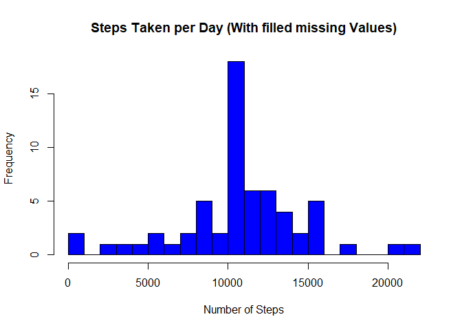
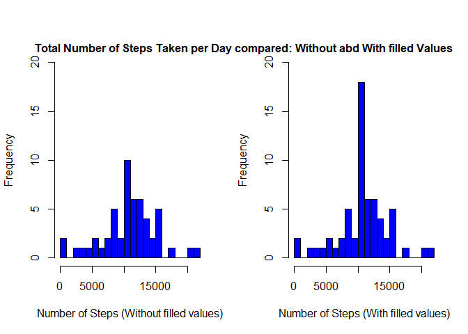
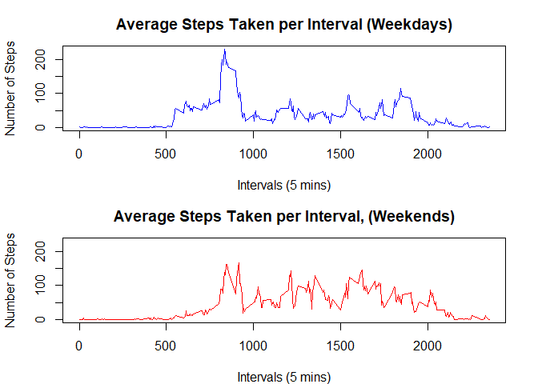

## Loading and preprocessing the data


```r
unzip("activity.zip")
rawData <- read.csv("activity.csv", colClasses = c("numeric", "Date", "numeric"))
```


```r
head(rawData)
```

```
##   steps       date interval
## 1    NA 2012-10-01        0
## 2    NA 2012-10-01        5
## 3    NA 2012-10-01       10
## 4    NA 2012-10-01       15
## 5    NA 2012-10-01       20
## 6    NA 2012-10-01       25
```


## What is mean total number of steps taken per day?

Missing values can be ignored


```r
data <- rawData[!(is.na(rawData$steps)), ]
```

The data is grouped for each day and then the sum of each day is calculated


```r
stepsPerDay <- aggregate(steps ~ date, data, sum)
head(stepsPerDay)
```

```
##         date steps
## 1 2012-10-02   126
## 2 2012-10-03 11352
## 3 2012-10-04 12116
## 4 2012-10-05 13294
## 5 2012-10-06 15420
## 6 2012-10-07 11015
```

The steps taken per day are represented in the following histogram:


```r
hist(stepsPerDay$steps, breaks = 20, xlab = "Number of Steps", 
     main = "Steps Taken per Day",
     col = "blue")
```

<!-- -->

Finally, the summarise function can calculate the mean and median values of the total number of steps taken per day.


```r
summary(stepsPerDay)
```

```
##       date                steps      
##  Min.   :2012-10-02   Min.   :   41  
##  1st Qu.:2012-10-16   1st Qu.: 8841  
##  Median :2012-10-29   Median :10765  
##  Mean   :2012-10-30   Mean   :10766  
##  3rd Qu.:2012-11-16   3rd Qu.:13294  
##  Max.   :2012-11-29   Max.   :21194
```

The mean value is **10766** and the median value is **10765**.  


## What is the average daily activity pattern?

For the average daily pattern, we can create a time series plot showing the average steps taken per interval


```r
meanStepsInterval <- aggregate(steps ~ interval, data, mean)
head(meanStepsInterval)
```

```
##   interval     steps
## 1        0 1.7169811
## 2        5 0.3396226
## 3       10 0.1320755
## 4       15 0.1509434
## 5       20 0.0754717
## 6       25 2.0943396
```


```r
plot(meanStepsInterval$interval, meanStepsInterval$steps, type = "l",
     main = "Average Steps Taken per Interval",
     ylab = "Number of Steps", xlab = "Intervals (5 mins)",
     col = "blue", lwd = 1.5)
```

<!-- -->


To get the interval with the maximun number of steps the funcion max() is used


```r
meanStepsInterval[grep(max(meanStepsInterval$steps), meanStepsInterval$steps), ]
```

```
##     interval    steps
## 104      835 206.1698
```

The interval with the maximum number of steps is iterval **835**.


## Imputing missing values


There are missing values, so first we need to know where they are:


```r
data.frame(steps = sum(is.na(rawData$steps)), 
           interval = sum(is.na(rawData$interval)), 
           date = sum(is.na(rawData$date)))
```

```
##   steps interval date
## 1  2304        0    0
```


All the missing values are on the steps column and will be replaced with the mean of the corresponding interval which we calculated previosuly


```r
filledData <- rawData
for(row in 1:nrow(filledData)) {
    if(is.na(filledData[row, 1]) == TRUE) {
        filledData[row, 1] <- meanStepsInterval[meanStepsInterval$interval %in% filledData[row, 3], 2]
    }
}
head(filledData)
```

```
##       steps       date interval
## 1 1.7169811 2012-10-01        0
## 2 0.3396226 2012-10-01        5
## 3 0.1320755 2012-10-01       10
## 4 0.1509434 2012-10-01       15
## 5 0.0754717 2012-10-01       20
## 6 2.0943396 2012-10-01       25
```


Now we can create a histogram using the data with filled values


```r
filledStepsPerDay <- aggregate(steps ~ date, filledData, sum)
head(filledStepsPerDay)
```

```
##         date    steps
## 1 2012-10-01 10766.19
## 2 2012-10-02   126.00
## 3 2012-10-03 11352.00
## 4 2012-10-04 12116.00
## 5 2012-10-05 13294.00
## 6 2012-10-06 15420.00
```


Creating the histogram:


```r
hist(filledStepsPerDay$steps, breaks = 20, xlab = "Number of Steps", 
     main = "Steps Taken per Day (With filled missing Values)",
     col = "blue")
```

<!-- -->

Then we can get the mean and median and the values can be compared with the values obtained without filling the missing data


```r
summary(filledStepsPerDay)
```

```
##       date                steps      
##  Min.   :2012-10-01   Min.   :   41  
##  1st Qu.:2012-10-16   1st Qu.: 9819  
##  Median :2012-10-31   Median :10766  
##  Mean   :2012-10-31   Mean   :10766  
##  3rd Qu.:2012-11-15   3rd Qu.:12811  
##  Max.   :2012-11-30   Max.   :21194
```


```r
summary(stepsPerDay)
```

```
##       date                steps      
##  Min.   :2012-10-02   Min.   :   41  
##  1st Qu.:2012-10-16   1st Qu.: 8841  
##  Median :2012-10-29   Median :10765  
##  Mean   :2012-10-30   Mean   :10766  
##  3rd Qu.:2012-11-16   3rd Qu.:13294  
##  Max.   :2012-11-29   Max.   :21194
```


Because the missing values were replaces with the mean for the corresponding interval, the mean values are the same: **10766** steps. On the other side, median value is a bit larger in the filled data set, at **10766** steps instead of **10765** steps.

If histograms of the two data sets (imputed and non-imputed) are compared:


```r
par(mfrow = c(1, 2))
hist(stepsPerDay$steps, breaks = 20, xlab = "Number of Steps (Without filled values)", 
     col = "blue", ylim = c(0, 20), main = NULL)
hist(filledStepsPerDay$steps, breaks = 20, xlab = "Number of Steps (With filled values)", 
     col = "blue", ylim = c(0, 20), main = NULL)
mtext("Total Number of Steps Taken per Day compared: Without abd With filled Values",
      adj = 0.95, font = 2)
```

<!-- -->

We can see that the frequency of values increases in the second histogram, which is expected, due to the filled values. 


## Are there differences in activity patterns between weekdays and weekends?

The data set with the filled missing values will be used.


```r
Sys.setlocale(category = "LC_ALL", locale = "english")
```

```
## [1] "LC_COLLATE=English_United States.1252;LC_CTYPE=English_United States.1252;LC_MONETARY=English_United States.1252;LC_NUMERIC=C;LC_TIME=English_United States.1252"
```

```r
daysData <- filledData
daysData$days <- weekdays(daysData$date)
daysData$weekday <- as.character(rep(0, times = nrow(daysData)))
for(row in 1:nrow(daysData)) {
    if(daysData[row, 4] %in% c("Saturday", "Sunday")) {
        daysData[row, 5] <- "weekend"
    } else {
        daysData[row, 5] <- "weekday"
    }
}
daysData$weekday <- factor(daysData$weekday)
head(daysData)
```

```
##       steps       date interval   days weekday
## 1 1.7169811 2012-10-01        0 Monday weekday
## 2 0.3396226 2012-10-01        5 Monday weekday
## 3 0.1320755 2012-10-01       10 Monday weekday
## 4 0.1509434 2012-10-01       15 Monday weekday
## 5 0.0754717 2012-10-01       20 Monday weekday
## 6 2.0943396 2012-10-01       25 Monday weekday
```

The data is then separated in two subsets


```r
weekdayData <- daysData[daysData$weekday=="weekday", ]
weekendData <- daysData[daysData$weekday=="weekend", ]
```

Then, the average number of steps for each interval is calculated in each subset:


```r
weekdayMean <- aggregate(steps ~ interval, weekdayData, mean)
weekendMean <- aggregate(steps ~ interval, weekendData, mean)
```


Finally, a time series plot is created for each subset:


```r
par(mfrow=c(2, 1), mar=c(4, 4.1, 3, 2.1))
plot(weekdayMean$interval, weekdayMean$steps, type = "l",
     main = "Average Steps Taken per Interval (Weekdays)",
     xlab = "Intervals (5 mins)", ylab="Number of Steps",
     col = "blue", lwd = 1.5, ylim = c(0, 230))
plot(weekendMean$interval, weekendMean$steps, type = "l",
     main = "Average Steps Taken per Interval, (Weekends)",
     xlab = "Intervals (5 mins)", ylab = "Number of Steps",
     col = "red", lwd = 1.5, ylim = c(0, 230))
```

<!-- -->
